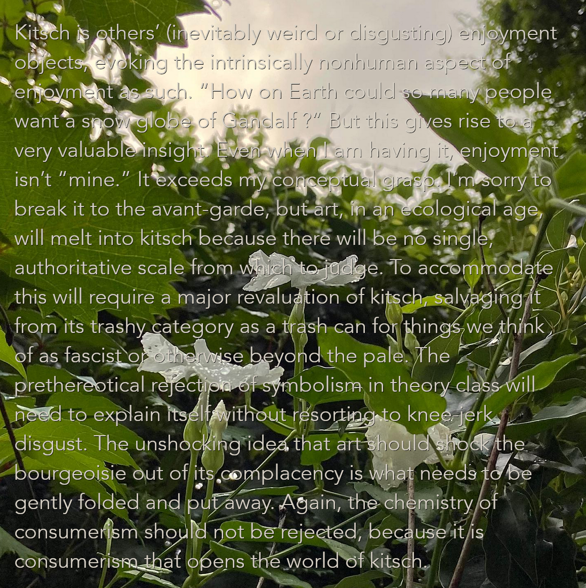

# pg 146 dark ecology
Kitsch is others’ (inevitably weird or disgusting) enjoyment objects, evoking the intrinsically nonhuman aspect of enjoyment as such. “How on Earth could so many people want a snow globe of Gandalf ?” But this gives rise to a very valuable insight. Even when I am having it, enjoyment isn’t “mine.” It exceeds my conceptual grasp. I’m sorry to break it to the avant-garde, but art, in an ecological age, will melt into kitsch because there will be no single, authoritative scale from which to judge. To accommodate this will require a major revaluation of kitsch, salvaging it from its trashy category as a trash can for things we think of as fascist or otherwise beyond the pale. The prethereotical rejection of symbolism in theory class will need to explain itself without resorting to knee-jerk disgust. The unshocking idea that art should shock the bourgeoisie out of its complacency is what needs to be gently folded and put away. Again, the chemistry of consumerism should not be rejected, because it is consumerism that opens the world of kitsch.

---

<!--

[image:41082BFB-40FC-4BCA-967A-2D7A6FDAA281-13414-00000EBC039D5841/9903E504-5798-424A-885C-9421982E5B0C.png]
-->

[copying layer from gimp to paste into bear??]

---

<!--

[file:5BC42DB1-F05B-4EDE-A531-FBC1B1ABC87D-13414-00000EC77F92F429/dark-ecology-ft.-brey.xcf]

-->

---

<!-- 

[image:F1A61C57-2D72-4CCA-B7E3-5BD882E0530A-13414-00000EC92DE4BCAE/dark-ecology-ft.-brey.png]

-->

---

## persevere awhile chapped oxygen tweak enhance rhyme hummus smugness shindig usher video headed tripping1
notion reliable appealing keeping qualities failure definitionof carries replaces suspension neglects justifies
circumstance serving exculpatory present explore likelihood involved whirring coffee opponents merits describe
double thinking acceptability quality original swapping forced perspective contextualists compliance quantified smuggling
minimal furthers noting fundamentally victims audiences interesting hiding misguided deserving presupposes complication
contextualists supplemented spaces invitation balloons namely partly character denying threatens supported repeated
degreesof address judges flavors website generated standard minority contrasting element literally section
articulating yesterday dropped objects supposing unstructured predicted expert potential induce nuanced disabled
cerned driving explanations sounds directly normally regulators echoed evaluation traditional capable weakening
swallowers remember comments consulted tempered degrees immoral context favorable numerical judiciously readings
validly produc- typical abilistic ground- bookkeeping relativity unkind elided ignorant circumscribed variables
